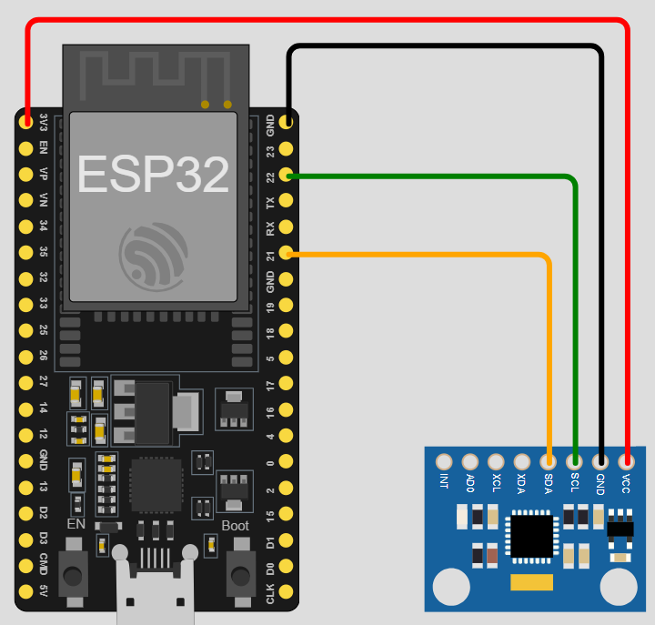

# Firmware

ESP32 firmware for the LegoDemo project with MPU6050 motion sensor integration.

## Hardware Requirements

- ESP32 development board
- MPU6050 IMU sensor (accelerometer + gyroscope)
- Connection wires

## Wiring

Connect MPU6050 to ESP32:
- VCC → 3.3V
- GND → GND
- SCL → GPIO 22 (default I2C clock)
- SDA → GPIO 21 (default I2C data)
- AD0 → GND (optional - sets I2C address to 0x68; leave floating for 0x69)

**Note**: If you connect AD0 to GND, you must update the I2C address in the code from the default 0x69 to 0x68.




## Software Requirements

- Arduino IDE 1.8.x or later
- ESP32 board support installed
- MPU6050_light library

## Installation

### 1. Install Arduino IDE

Download from [arduino.cc](https://www.arduino.cc/en/software)

### 2. Add ESP32 Board Support

1. Open Arduino IDE
2. Go to File → Preferences
3. Add to "Additional Board Manager URLs":
   ```
   https://dl.espressif.com/dl/package_esp32_index.json
   ```
4. Go to Tools → Board → Board Manager
5. Search "esp32" and install "ESP32 by Espressif Systems"

### 3. Install MPU6050_light Library

1. Go to Sketch → Include Library → Manage Libraries
2. Search "MPU6050_light"
3. Install the library by rfetick

### 4. Configure and Upload

1. Open `ESP32_LEGO_BLE/ESP32_LEGO_BLE.ino` in Arduino IDE
2. Select your ESP32 board: Tools → Board → ESP32 Arduino → (your board)
3. Select the correct port: Tools → Port → (your COM/USB port)
4. Click Upload (→) button

**Important**: Place the ESP32 on a flat, level surface before powering on for proper calibration.

## BLE Configuration

The firmware implements a BLE server with the following characteristics:
- Device name: "ESP32_MPU6050_BLE"
- Service UUID: `c10299b1-b9ba-451a-ad8c-17baeecd9480`
- Characteristic UUID: `657b9056-09f8-4e0f-9d37-f76b6756e95e`
- Data format: 28-byte binary packets (timestamp + 6 floats)
- Update rate: 100ms (10 Hz) via hardware timer interrupt

## Features

- Real-time motion data collection from MPU6050 (accelerometer + gyroscope)
- BLE server for wireless communication
- Automatic sensor calibration on startup (must be on flat surface)
- Hardware timer interrupt for precise 100ms sampling
- 28-byte binary packet format (timestamp + 6 sensor values)
- Continuous data streaming at 10 Hz

## Troubleshooting

### Upload fails:
- Check USB cable connection
- Press and hold BOOT button during upload
- Verify correct COM port selected

### Sensor not responding:
- Check I2C wiring
- Verify MPU6050 power supply (3.3V)
- Try sensor calibration
- If AD0 is connected to GND, ensure code uses I2C address 0x68 instead of default 0x69
- If AD0 is connected to GND, ensure code uses I2C address 0x68 instead of default 0x69

### BLE not visible:
- Ensure Bluetooth is enabled on client device
- Check if device name appears in BLE scanner
- Verify ESP32 is not already connected to another device

## Configuration

Edit `ESP32_LEGO_BLE.ino` to customize:
- BLE device name (currently: `"ESP32_MPU6050_BLE"`)
- Service/Characteristic UUIDs
- Measurement interval (currently: `100` ms)
- Data packet structure

## License

MIT
